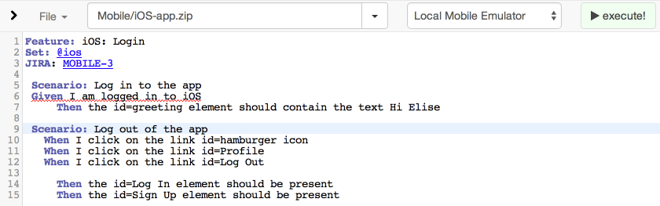
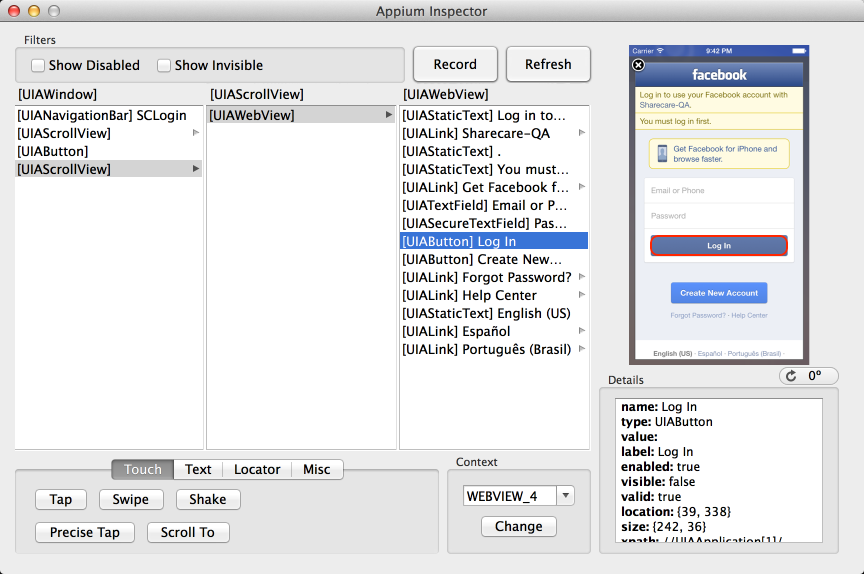
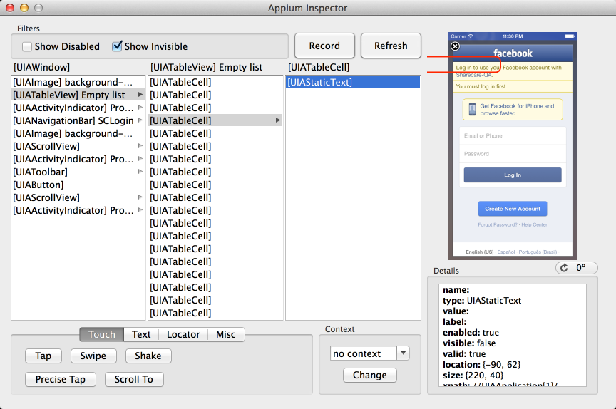
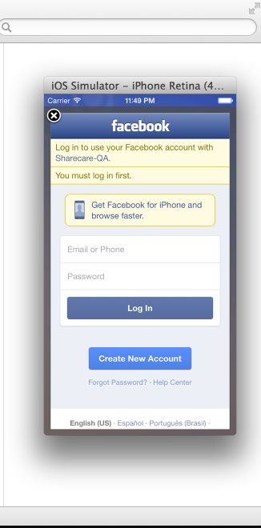
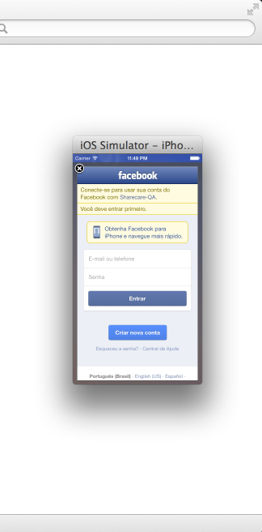
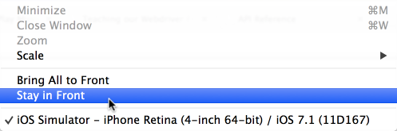

title: Teaching our Webdriver Framework new Appium tricks
author:
  name: Daniel Gempesaw
  twitter: dgempesaw
  url: http://danielgempesaw.com/appium-talk
output: index.html
controls: true

--

# The road to Appium
## Teaching our Webdriver Framework new Appium tricks

--

### about

* I work for Sharecare.com

<!-- I work for Sharecare.com, which is a health and wellness -->
<!-- platform. We aim to provide our users with information and -->
<!-- resources to help improve their health.  We've got a social media -->
<!-- aspect of our site so that our users can interact with each -->
<!-- other, and then a CMS portion where we're presenting curated -->
<!-- content like question/answer documents for our users, so our -->
<!-- testing spans a wide range of responsibilities.-->

* as their Software Testing Architect

<!-- My title is Software Testing Architect, which basically means I'm -->
<!-- in charge of all of the in-house tooling that our QA group uses -->
<!-- for testing. Any time we've got a new challenge or set up to -->
<!-- test, I'll either adapt an existing tool to fit the challenge or -->
<!-- create something new as approriate. -->

* [Selenium::Remote::Driver][srd], [Appium][]

<!-- I also moved into the maintainer role for the Perl Webdriver -->
<!-- bindings, and I just started working on the perl Appium bindings -->
<!-- a few weeks ago. Also, if there are any Emacs users in the room, -->
<!-- I maintain a couple emacs packages, including -->
<!-- ido-vertical-mode. Any bugs in that are completely my fault :D-->

[srd]: https://metacpan.org/pod/Selenium::Remote::Driver
[Appium]: https://metacpan.org/pod/Appium

--

### our (pre-mobile) process

* QA group is in charge of e2e tests

<!-- To set the scene a little bit, our process at the beginning of -->
<!-- the year relied heavily on our in-house Webdriver framework. Our -->
<!-- devs worked on features and bugfixes and generate builds for us -->
<!-- to test. We'd use a combination of automated tests for -->
<!-- functionality along with manual verification of the newest -->
<!-- features, right, and each sprint our automated test suite would -->
<!-- grow a little bit. -->

* Established in-house Webdriver framework: Honeydew

<!-- Our in-webdriver framework is named Honeydew, as an amazingly -->
<!-- clever pun off of Cucumber. A couple years ago we had decided to -->
<!-- make our own framework in Perl to give us a bit more flexibility, -->
<!-- and it kept us internally consistent, since many of our other -->
<!-- internal tools were written in perl. Other than being in Perl, -->
<!-- the basics are pretty similar- it accepts Gherkin-style -->
<!-- Given-When-Then feature files and parses them into Webdriver -->
<!-- instructions. We use the feature files not only as tests but also -->
<!-- as readable documentation, and as part of our onboarding for new -->
<!-- hires to help them get familiarized with the site. -->

* Dashboards, nightly monitoring, custom JIRA integrations, email
  reporting, ...

<!-- We were pretty heavily invested in Webdriver - we've got a custom -->
<!-- IDE for authoring our features, similar to Cucumber Pro's -->
<!-- offerings, dashboards, email reporting, nightly monitoring, -->
<!-- integrations with JIRA, our bug tracker, tie-ins with our -->
<!-- TeamCity CI servers, and a substantial adoption of the Gherkin -->
<!-- syntax. -->

--

### huh? what's appium

* mobile is the new focus!

<!-- Earlier this year, Sharecare decided to prioritize mobile - both -->
<!-- for our website and also in the form of new mobile apps. move -->
<!-- fast without breaking things! For me, this meant we needed to -->
<!-- assess the mobile testing frameworks and come up with a workable -->
<!-- solution. -->

* Need to test Android and iOS apps from OS X & Windows

<!-- Like everyone else, we looked at a number of different -->
<!-- options. We looked briefly into KiF, and we surveyed our options -->
<!-- as well. Appium fit us pretty well for a few reasons  -->

* Our Webdriver investment + cross-platform testing requirements = Appium!

<!-- In the QA group, we had been keeping tabs on Appium since a few -->
<!-- months before the 2013 SeConf, but our devs hadn't heard of -->
<!-- it. We looked into KiF and surveyed our other options, but Appium -->
<!-- seemed like the obvious choice the whole time. -->

<!-- Since it'd be the QA engineers in charge of testing, we'd need to -->
<!-- be the ones familiar with the test framework - while we might not -->
<!-- have developer in our title, our QA engineers all possess the analytic -->
<!-- capabilities to code in Gherkin pseudo language for testing -->
<!-- browsers. We wanted to re-use those same abstractions and make -->
<!-- things easy for our QA group to transition to and from mobile testing. -->

* Consistent troubleshooting and open source: both pluses!

<!-- Working with one tool for both iOS and Android would also make -->
<!-- troubleshooting much easier. Also, using Appium, we'd also get -->
<!-- all of our existing infrastructure for free - reporting, -->
<!-- dashboards, monitoring, etc. -->

<!-- Additionally, the fact that Appium was open source made a big -->
<!-- difference for us as well - being able to interact directly with -->
<!-- the project authors when diagnosing bugs is pretty -->
<!-- invaluable. -->

--

### non-Appium solutions ?

<!-- For some of our work, it actually turns out that Appium does have -->
<!-- the functionality to test, but for various reasons we decided to -->
<!-- go other routes. One instance was when we were having issues with -->
<!-- analytics calls on the mobile version of our web app. Appium -->
<!-- definitely has the ability to automate the actual mobile browsers -->
<!-- on a mobile device, but it was less attractive for this case -->
<!-- because our testers for our mobile web app were responsible for a -->
<!-- much wider range of devices, and they weren't using an OS X -->
<!-- machine as their main workstation. -->

* Is UserAgent spoofing alone a viable choice?

<!-- Depending on how your mobile web app is determining its content, -->
<!-- you may have the option of spoofing your desktop browser's user -->
<!-- agent and having it masquerade as a mobile browser. This is a -->
<!-- little tricky, because it's possible the behavior on the -->
<!-- desktop-as-mobile browser isn't an exact match for an actual -->
<!-- mobile browser, but in our case we were able to reproduce the -->
<!-- bug on our desktops and avoid going through some of the Appium -->
<!-- infrastructure setup. -->

* Or, setting the browser size via Webdriver's APIs

<!-- And, if you're in the lucky case where your web app reflows its -->
<!-- content solely based on browser size, that's happily even easier -->
<!-- than having to spoof your browser size. We have a small table of -->
<!-- mobile browser screen sizes, but I'm sure it's possible to look -->
<!-- 'em up and emulate the mobile device we're hoping to test. -->

* Exactly what the user sees?

<!-- There's definitely a fine line between compromising on testing -->
<!-- exactly what the user sees, and saving yourself devleopment time -->
<!-- by testing in a headless browser, or with a spoofed user -->
<!-- agent. Making that decision really depends on how important the -->
<!-- functionality is, and what kind of bugs are high risk for that -->
<!-- feature. -->

--

### extending our framework

<!-- We started out using our normal webdriver bindings. If you're -->
<!-- just doing simple tests like we were at first, it's actually -->
<!-- possible to get a decent amount done without using a specific -->
<!-- client library. Views with only a few forms or flows that are -->
<!-- mostly just clicking are pretty easily accomplished with the -->
<!-- standard Selenium bindings. Early on, this is pretty attractive - -->
<!-- little to no extra effort and a decently big payoff, especially -->
<!-- if you're not doing any mobile specific things like hiding the -->
<!-- keyboard or switching to webviews. -->

* Started out using our normal webdriver bindings

<!-- A big plus for us was that the same way that the standard -->
<!-- Selenium bindings cover a decent amount of Appium functionality -->
<!-- also meant that a number of our step rules carried over from -->
<!-- the desktop version of our framework. So, we get to avoid some -->
<!-- overhead there for our engineers and re-use the syntax they're -->
<!-- already used to! -->

* Exactly the same Gherkin step rules

<!-- From the front-end of our framework, we were able to make it -->
<!-- pretty much a transparent drop in. Just choose 'mobile device' as -->
<!-- the endpoint and we taught our framework how to figure out the -->
<!-- rest behind the scenes. But, it took a lot of trial and error to -->
<!-- get everything in place, and I'm going to dig into some of those -->
<!-- issues that we've learned along the way. -->

* Pretty much a drop in solution at first!



--

### building your app

<!-- first things first, we'll need an app to test. I'd strongly -->
<!-- recommend figuring out how to compile your app. This is a -->
<!-- feedback loop thing - being able to add accessibilityIdentifiers -->
<!-- in iOS or resource IDs in android and immediately recompiling -->
<!-- your app make the testing process much smoother. That way, you -->
<!-- can go to your devs with a PR or a patch and make much quicker -->
<!-- progress. -->

* control your feedback loop!

`gradle clean assemble`

```bash
xcodebuild -sdk iphonesimulator7.1 TARGETED_DEVICE_FAMILY=1 \
           -arch i386 -config Release | xcpretty
```

<!-- I personally prefer to be building on the command line, and these -->
<!-- are the settings that work for me and my projects. But, there's -->
<!-- definitely other options and configurations for your projects: -->
<!-- XCode and Android Studio obviously can build your project as -->
<!-- well, and there are other methods like if you're using PhoneGap -->
<!-- or Ionic. The point is to shorten your own feedback loop as much -->
<!-- as possible and with a mobile app, compiling it yourself is -->
<!-- pretty viable and can make a big difference. -->

--

### installation and set up

<!-- So, if you're just getting started with installing Appium, there -->
<!-- are definitely a lot of moving parts. If you use the -->
<!-- Appium.app at first, a lot of those issues are taken care of, but -->
<!-- if you're building out your framework, you'll need to address -->
<!-- them. The `appium-doctor` tool is super useful and helps you get -->
<!-- everything installed, similar to homebrew's `brew doctor`. There -->
<!-- are a lot of steps to get through, but most of them are pretty -->
<!-- simple, like pasting bash commands. Google and thickheaded -->
<!-- persistence is definitely key here!  -->

* Setup can be little involved. `appium-doctor` & some deep breathing!
* Read up on the [desired capabilities][caps]

[caps]: http://appium.io/slate/en/master/#appium-server-capabilities

```perl
my $android = {
    app             => '/path/to.apk',
    appActivity     => '.application.MainActivity',
    appPackage      => 'com.your.android.app',
    platformName    => 'Android',
    platformVersion => '4.4'
};
```

```perl
my $ios = {
    app             => 'http://remote.path/to.app',
    deviceName      => 'iPhone Simulator',
    platformName    => 'iOS',
    platformVersion => '7.1'
};
```

<!-- First things first - we can't start an appium session without -->
<!-- desired capabilities, so we'll start here too. If your bindings -->
<!-- have a Capabilities class, it's a very good idea to take -->
<!-- advantage of it, or roll your own class if you'd like. A lot of -->
<!-- our early issues were just problems sorting out the caps. With -->
<!-- the recent Appium milestones, the caps have gotten a lot more -->
<!-- reliable, but managing them by hand can definitely be error -->
<!-- prone. -->

--

### play with Appium.app & `appium`

<!-- this is a lot less of a problem with recent Appium releases, but -->
<!-- some of the early point releases would create issues where I'd -->
<!-- have trouble with the GUI app on my machine. On the other hand, -->
<!-- my coworkers had no problems with Appium.app, but had cryptic -->
<!-- errors from the console version. Both are happily working now, -->
<!-- but being familiar with both of the options gives you the -->
<!-- flexibility to keep working in case of an inadvertant update. -->

* insulate yourself from problems

* use the right tool for the job

```bash
$ appium
info: Welcome to Appium v1.2.0 (REV e53f49c706a25242e66d36685c268b599cc18da5)
info: Appium REST http interface listener started on 0.0.0.0:4723
debug: Non-default server args: {"fullReset":true,"logNoColors":true,"avd":"appium"}
info: LogLevel: debug
info: --> GET /wd/hub/status {}
debug: Appium request initiated at /wd/hub/status
debug: Request received with params: {}
debug: Responding to client with success: {"status":0,"value":{"build":{"version":"1.2.0","revision":"e53f49c706a25242e66d36685c268b599cc18da5"}}}
info: <-- GET /wd/hub/status 200 4.053 ms - 104 {"status":0,"value":{"build":{"version":"1.2.0","revision":"e53f49c706a25242e66d36685c268b599cc18da5"}}}
```

<!-- This kind of falls under using the right tool for the job - when -->
<!-- I'm authoring a new test, I'm using the GUI app and the inspector -->
<!-- to drill down through the app and work out the flows. But, when -->
<!-- we're running regression tests for the mobile apps, it makes more -->
<!-- sense to use the console version set up on a grid endpoint -->
<!-- somewhere instead. -->

--

### get familiar with the inspector! and/or `arc`

<!-- and, speaking of the inspector, we'll definitely need to be -->
<!-- prepared to get pretty familiar with it. The inspector from the -->
<!-- GUI app is like the DevTools console in Chrome or Firefox - it's -->
<!-- your map to your application. It's got a few quirks but using the -->
<!-- preview pane has become indispensable for generating locators and -->
<!-- authoring scripts. -->


<br />
`gem install appium_console`, [\(additional docs\)](http://appium.io/slate/en/tutorial/ios.html?ruby#appium-ruby-console)

<!-- Another option is to use the appium_console and its associated -->
<!-- executable `arc`. ARC is doubly helpful if you're using the ruby -->
<!-- bindings, as the commands issued to arc transfer right over to -->
<!-- your automation. ARC is a REPL for an appium session, and after -->
<!-- installing the gem, all you need to do is configure a simple -->
<!-- appium.txt file with the desired capabilities you want. Invoke -->
<!-- $ arc and you get an emulator running your app that you can query -->
<!-- and work with. My coworker Carl Mitchell strongly recommends this -->
<!-- tool, and I've found it to be very useful as well. -->

--

### don't check options you don't understand and then forget



<!-- In one of the older releases of the appium inspector, I was just -->
<!-- clicking around and saw these two options up here. I thought to -->
<!-- myself, "oh, I'm pretty advanced at Appium, I'm a power user, -->
<!-- they wouldn't put something here that would be too -->
<!-- detrimental. Give me all the information, I'll figure out what to -->
<!-- do it with," and idly checked these boxes and promptly forgot -->
<!-- about it. A week later I came back to Appium and the inspector, -->
<!-- and apparently something funny was going on with my app at the -->
<!-- time, because suddenly all of the inspection boxes were off -->
<!-- center and I couldn't click through to anything. Then you'll have -->
<!-- to go and ask google things like "the red boxes in the inspector -->
<!-- aren't where they're supposed to be" and google won't have any -->
<!-- clue what you're talking about, and it'll be a mess all -->
<!-- around. -->

--

### iOS specific items

* Use accessibilityIdentifier!

* You can resize the iOS emulator ⌘ - 1, ⌘ - 2, ⌘ - 3





--

### iOS specific items

* Keep it on top!



* Real iOS device? needs a provisioning profile, UDID, .ipa ... [\(docs\)](http://appium.io/slate/en/master/#appium-on-real-ios-devices)

--

### Android specific items

* Issues re-using Android emulators

```bash
TARGET=android-19
ABI=x86
NAME=appium-avd

echo "Overwriting & creating new emulator..."
echo no | android create avd --force -n $NAME -t $TARGET --abi $ABI
# emulator @$NAME &
```

* Headless android dependency install

```bash
(while :
do
  echo 'y'
  sleep 2
done) | android update sdk --no-ui --filter platform-tool,android-19,extra,build-tools-19.1.0
```
--

### additional resources

* official documentation: http://appium.io/slate/en/master/

* [appium-discuss](https://groups.google.com/forum/#!forum/appium-discuss)

* [Appium's HipChat](http://appium.io/chat)

* Saucelabs' Appium [bootcamp series](http://sauceio.com/index.php/2014/07/appium-bootcamp-get-started-with-appium-testing-chapter-1/) via Dave Haeffner
